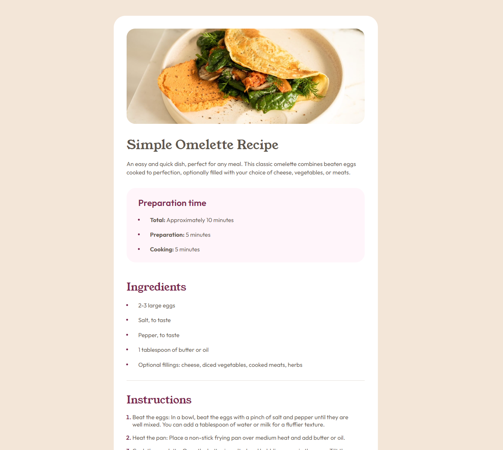

# Frontend Mentor - Recipe page solution

This is a solution to the [Recipe page challenge on Frontend Mentor](https://www.frontendmentor.io/challenges/recipe-page-KiTsR8QQKm). Frontend Mentor challenges help you improve your coding skills by building realistic projects. 

## Table of contents

- [Overview](#overview)
  - [The challenge](#the-challenge)
  - [Screenshot](#screenshot)
  - [Links](#links)
- [My process](#my-process)
  - [Built with](#built-with)
  - [What I learned](#what-i-learned)
  - [Continued development](#continued-development)
  - [Useful resources](#useful-resources)
- [Author](#author)
- [Acknowledgments](#acknowledgments)

**Note: Delete this note and update the table of contents based on what sections you keep.**

## Overview

### Screenshot

### Links

- Solution URL: [Solution URL](https://github.com/vgarmy/recipe-page-main)
- Live Site URL: [Live site](https://vgarmy.github.io/recipe-page-main/)

## My process

### Built with

- Semantic HTML5 markup
- CSS custom properties
- Flexbox
- Scss
- Mobile-first workflow
- [React](https://reactjs.org/) - JS library

### What I learned

Today a acually found out that mobil first makes it a lot easier.

### Continued development

Train on the @media only screen

## Author

- Website - [Vladimir GitHub Page](https://github.com/vgarmy/)
- Frontend Mentor - [@vgarmy](https://www.frontendmentor.io/profile/vgarmy)
